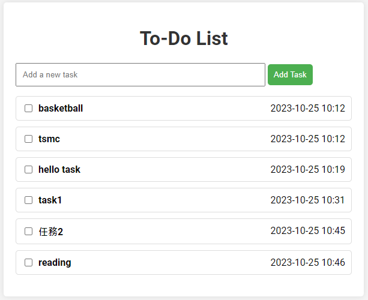

# To-do tasks with Golang
這是一個 Web 介面的代辦事項清單應用程式，可以新增、更新和刪除任務。
以 html、css、JS 作為前端，Golang實作後端功能並操作資料庫。並將專案與資料庫分別以 container 呈現，提升資源利用及部署效率。
正在規劃加入 google Oauth2.0 做為使用者驗證以及將資料庫轉為 NoSQL 
(golang目前不支援mongodb 6.0以上版本，故暫時使用mysql作為資料庫)。

{: .center-block }
<center></center>

## 使用的技術
- Golang (Go)
- Gin (Gin Web 框架)
- Restful API
- Docker
- HTML
- CSS
- JavaScript
- MySQL

## 使用方式
1. clone 程式碼
   ```bash
   git clone https://github.com/ryanou97/To-do-list-with-Golang.git
   cd your-repository
   ```

2. 建立 MySQL user 與資料庫'todo_db'
   ```bash
   CREATE USER 'user'@'localhost' IDENTIFIED BY '1234';
   GRANT ALL PRIVILEGES ON *.* TO 'user'@'localhost';
   flush privileges;
   CREATE DATABASE todo_db; 
   ````

3. 如果配置是主程式在本地端跑，mysql 使用 docker，那需要改成以下方式創建使用者，因為 docker 不覺得他和你在同一個本地端。
   ```bash
   CREATE USER 'username'@'172.17.0.1' IDENTIFIED BY '1234';
   GRANT ALL PRIVILEGES ON . TO 'username'@'172.17.0.1';
   flush privileges;
   ````

4. 執行程式
   ```bash
   go run main.go
   ```

5. 開啟 ([[https://www.google.com](http://localhost:8080/public)](http://localhost:8080/public))

## Docker
1. 安裝 DOCKER
2. main.go 裡資料庫連線的部分需要跟改
   ```Go
   func init() {
   	var err error
   	// 開啟 MySQL 資料庫連接
   	db, err = sql.Open("mysql", "user:1234@tcp(todo_mysql)/todo_db")
   	if err != nil {
   		log.Fatal(err)
   	}
   ```
4. 在資料夾下建立 DOCKERFILE
   ```DOCKERFILE
   FROM        golang
   RUN         mkdir -p /app
   WORKDIR     /app
   COPY        . .
   RUN         go mod download
   RUN         go build -o app
   ENTRYPOINT ["./app"]
   ```
5. 建立 image
   ```bash
   docker build -t todo_app:v1 .
   ```
6. 建立並執行 container (記得用 docker images 查看 image ID)
   ```bash
   docker run --name todo -p 8080:8080 -it "your_imageID"
   ```
